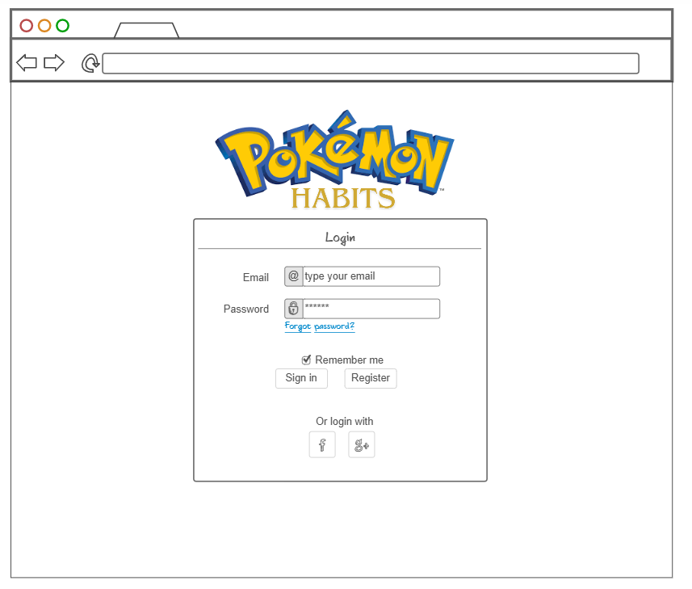
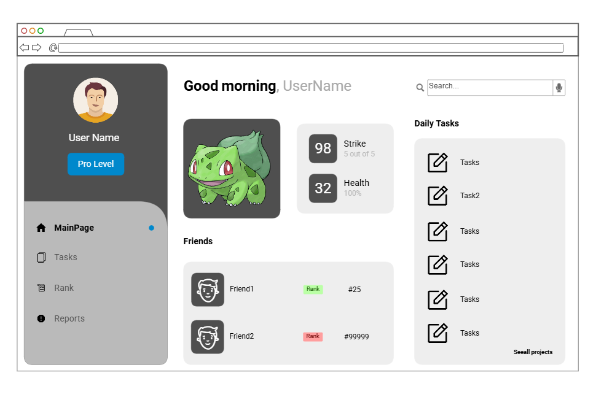

# Pokemon Habit Companion

The Pokémon Habit Companion is a gamified web application designed to help students and everyday users build consistent daily habits. Instead of checking off a boring to-do list, your progress fuels a partner Pokémon that gains XP, evolves, and stays healthy based on your real-world performance.

By completing simple daily tasks like studying, exercising, praying, eating breakfast, and getting enough sleep, users increase their Pokémon’s level and health. Skipping tasks lowers health and may make the Pokémon “sick.” This makes habit-tracking feel like a game, keeping users motivated with a clear, fun feedback loop.

The app uses React (Vite) for the frontend, an Express/Node.js service for backend logic, SQLite for persistent data storage, WebSockets (Socket.IO) for real-time updates, and PokeAPI to fetch authentic Pokémon sprites and data. Optional integration with ZenQuotes API provides daily motivational messages alongside your pet’s progress.

## 🚀 Specification Deliverable

### Elevator pitch

Building good habits is hard—so let a Pokémon cheer you on. With Pokémon Habit Companion, your daily tasks (study, exercise, prayer, sleep, breakfast) level up your Pokémon. Complete tasks to gain XP and health, unlock evolutions, and keep your buddy happy. Skip days and your Pokémon gets sick. It’s a fun, game-like way to build consistency—powered by live updates and real Pokémon data from PokeAPI.

### Design
## Rough Sketches

### Login Page

The login page will have an option for register and sign in, I haven't decided yet how will I deal with users, but probable I will use OAuth. That is why in the design you can see some sign in options logos.

### Dashboard Page

The main page will have the pokemon in the middle and different features, those in the image are just to illustrate and to separate spaces, but it might change within the features and the final design. 

### HTML Structure

- For now I have a main Dashboard with a nav bar on top with the different index, this is mostly for the startup activity and it will change within the future assignments. 

- The Task page will deal with the DB which will have a set of hardcoded tasks and an option to add tasks. Those will be linked with the users. You only will be able to add and check current tasks you are working on, I might add the old tasks options to so the user can go back in data.

- The Websocket part will be under Friends, you will be able to comment others strikes and check how your friends are doing with their tasks, as well as if their parterners have evolved. 

### Key features

- Secure login & registration.

- Task checklist with 5 daily core tasks.

- Pokemon that grows/evolves based on performance.

- Health decreases if tasks are neglected.

- Motivational quotes or fun facts from 3rd-party API.

- Real-time updates of pet stats via WebSockets.

- Persistent storage of user, pokemon-pet, and task history.

- Pokémon data (sprite, flavor text) from PokeAPI.

### Technologies

I am going to use the required technologies in the following ways.

- **HTML** - Basic structure for login, dashboard, and about pages.
- **CSS** - Styling pet UI, progress bars, and responsive layout.
- **React** - Components for login, task list, pet display, progress bars; React Router for navigation.
- **Service** - Backend endpoints for:
                    Register/login/logout
                    Get/update pet stats
                    Save daily tasks
                    Get motivational quotes (3rd-party API) 
- **DB/Login** - Store users, hashed passwords, pokemons, and task completions. 
- **WebSocket** - Broadcast Pokemon status changes and leaderboard updates in real time.

## 🚀 AWS deliverable

I will fulfill this part later when we have advance in the project.

## ALL THE UPCOMING PART WILL BE FILLED ONCE THE PROJECT ADVANCE

## 🚀 HTML deliverable

For this deliverable I did the following. I checked the box `[x]` and added a description for things I completed.

- [x] **HTML pages** - I complete some of this part, just creating placeholders for the future.
- [x] **Proper HTML element usage** - 
- [x] **Links** - I added the about me within the header.
- [ ] **Text** - I did not complete this part of the deliverable.
- [x] **3rd party API placeholder** 
- [x] **Images** - It is in the about me part for now
- [x] **Login placeholder** 
- [x] **DB data placeholder** 
- [x] **WebSocket placeholder** 

## 🚀 CSS deliverable

Besides the checklist under this text, I am still deciding about the colors I will have for my webapp, but probably some variations of blue just following the Pokemon pattern. 

For this deliverable I did the following. I checked the box `[x]` and added a description for things I completed.

- [x] **Header, footer, and main content body** - This is done however I would like to fix the color I will use for this..
- [x] **Navigation elements** - Some of the navigation elements are not how I like them to be, but they are working for now.
- [x] **Responsive to window resizing** - I check this with the inspect, resize for different screens and even used with my phone and it is working perfectly.
- [x] **Application elements** - I changed buttons and forms inputs.
- [x] **Application text content** - I reunified the text to use only one style. 
- [x] **Application images** - I change the format for the image in the about page with my profile picture, and for the tasks page.

About the responsive here are some examples on how it is working now

## 🚀 React part 1: Routing deliverable

For this deliverable I did the following. I checked the box `[x]` and added a description for things I completed.

- [x] **Bundled using Vite** - I added vite by running npm init -y and then npm install vite@latest to add the latest version. I created a different branch to keep good practices
- [x] **Components** - I migrated my previous pages to components now to use them with react. 
- [x] **Router** - I did add routes within my app.jsx to navigate between the different pages( by using the components)

Remember to add the import React on every other component other way it won't render those components. 

## 🚀 React part 2: Reactivity deliverable

For this deliverable I did the following. I checked the box `[x]` and added a description for things I completed.

- [x] **All functionality implemented or mocked out** - This was done within the previous assignment where I added functionality to all the pages in my nav, I dont know if something else is required or this is what the rubric specifies. 
- [x] **Hooks** - I did add UseState on home.jsx when fetching pokemons from the api, and useEffect and UseState on Data.jsx to keep track of the task manager part. This is rough still but will have more functionality after the next weeks. Now I added some changes to this I am just using useState and useContext. 
## 🚀 Service deliverable

For this deliverable I did the following. I checked the box `[x]` and added a description for things I completed.

- [ ] **Node.js/Express HTTP service** - I did not complete this part of the deliverable.
- [ ] **Static middleware for frontend** - I did not complete this part of the deliverable.
- [ ] **Calls to third party endpoints** - I did not complete this part of the deliverable.
- [ ] **Backend service endpoints** - I did not complete this part of the deliverable.
- [ ] **Frontend calls service endpoints** - I did not complete this part of the deliverable.
- [ ] **Supports registration, login, logout, and restricted endpoint** - I did not complete this part of the deliverable.

## 🚀 DB deliverable

For this deliverable I did the following. I checked the box `[x]` and added a description for things I completed.

- [ ] **Stores data in MongoDB** - I did not complete this part of the deliverable.
- [ ] **Stores credentials in MongoDB** - I did not complete this part of the deliverable.

## 🚀 WebSocket deliverable

For this deliverable I did the following. I checked the box `[x]` and added a description for things I completed.

- [ ] **Backend listens for WebSocket connection** - I did not complete this part of the deliverable.
- [ ] **Frontend makes WebSocket connection** - I did not complete this part of the deliverable.
- [ ] **Data sent over WebSocket connection** - I did not complete this part of the deliverable.
- [ ] **WebSocket data displayed** - I did not complete this part of the deliverable.
- [ ] **Application is fully functional** - I did not complete this part of the deliverable.

